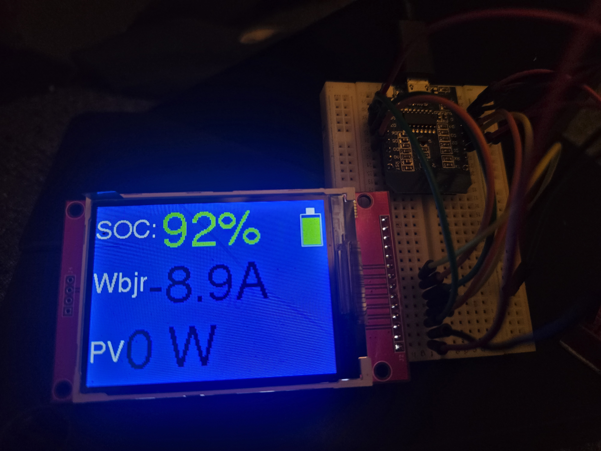

# Rev. 2 Wireless Display for Midnite Classic - No wiring to the Classic needed!
This project, wirelessly connects to the Midnite Classic and displays "State of Charge", "Wbjr" Amps, & PV Watts. The SOC text is color coded based on the SOC. There is a color coded battery level icon/graph. You can also add an optional low SOC alarm using a passive buzzer.

The nice thing is, all you need to do to the Classic is **connect your Classic to the internet with an Ethernet cable** and set up a static IP address for it on your router. If you are already using the "Classic Monitor" app or something similar, you probably allready did this.

# How it works: 
If your Classic is connected to the internet via an Ethernet cable and you have already assigned it a static IP. This setup will: 
- 1 Connect to your wifi
- 2 then connect to the Classic over wifi/Ethernet 
- 3 then read the Modbus data from the Classic 
- 4 then display the data on the serial output and the 320x240 pixel TFT screen using a ILI9341 driver.
- 5 If the SOC is less than 30% = the optional passive buzzer will buzz constantly until there is more than 15 amps going into the batteries. If there is more than 15 amps going into the batteries, it will only periodically beep.
- 6 Every 30 minutes, it will resart.

Here is the code for the SOC text color that is based on the SOC%:

      if (soc >= 80) {
        tft.setTextColor(ILI9341_GREEN);
      }
      else if (soc >= 50) {
        tft.setTextColor(ILI9341_BLACK);
      }
      else if (soc >= 30) {
        tft.setTextColor(ILI9341_ORANGE);
      }
      else {
      tft.setTextColor(ILI9341_RED);
      }

# How to set it up:
Connect the necessary pins together between the Wemos D1 and 320x240 pixel TFT. You may also add a passive buzzer to Wemos pin "D2" if you want.

    #define buzzer   D2 // Optional: Low SOC passive buzzer signal output -- Note: Must reconfigure code if using an active buzzer

    // TFT Pin   =   WEMOS D1 Mini Pin
    #define TFT_DC   D3          
    //      TFT RST  D4
    //      TFT SCK  D5
    //      TFT SDI  D7
    #define TFT_CS   D8          
    //      TFT LED  3v3
    //      TFT VCC  3v3

I used Arduino IDE to create the code and program the Wemos D1 board.
- Edit Line "74"  as seen below:

WiFi.begin("USERNAME", "PASSWORD"); // INCLUDE USER AND PASSWORD HERE*****
- Edit Line "27" to the Static IP for your Classic as seen below:

IPAddress remote(192,168,0,96); // Classic IP ***** CHANGE THIS TO YOURS****

- Download the libraries needed as seen at the top of the code. Obviously though, you may need different libraries if you are using different boards.

# Notes and future upgrades:

Feel free to email me at kg7zev@gmail.com with any questions. I plan on replacing the Wemos D1 with a D32 board that has bluetooth capability. 

While this board is connected to the Classic, you are unable to use any other software to connect to it such as the "Classic Monitor" app. However, the Midnite Solar "MyMidnite" website is unaffected. This doesn't bother me since I only use the app when setting up pannels or troubleshooting something and I really like having a basic remote display that I can mount anywhere!

While running, this draws 0.5 watts to power both the TFT screen and Wemos. The previous version with the small OLED screen draws 0.05 watts.

## The next update will be very usefull for Alaskans like me who are using the SOC% from the Midnite Classic to autostart a generator. 
The problem that can occur is if the Classic does not go into float for a couple of months, the SOC will be out of calibration. Last winter, this resulted in the Classic completely refusing to autostart the generator since there was no SOC number to use... This is extremely problematic if you have a small battery bank like I did last winter with a month and a half of no solar input. Midnite Solar is aware of this issue.

### To fix this issue I will add a relay module to the D32 for starting the generator and I'm going to explore a couple different alternatives for obtaining a SOC% listed below:
- 1 use the modbus data to calculate a secondary SOC% that will act as a backup.
- 2 connect the D32 board to the BMS in my Rolls Lithium batteries via bluetooth to read the SOC% provided by the batteries using their factory bluetooth connectivity. This will be the most accurate but also the hardest since Rolls only offers a closed source phone app to read this data.

